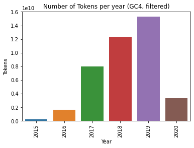

# German T5 Training corpus

This repository gives an overview of how to construct a corpus that can be used for pre-training a German T5 model.

# GC4: The German colossal, cleaned Common Crawl corpus

We use the previously released [GC4](https://german-nlp-group.github.io/projects/gc4-corpus.html) corpus as main backbone for training our German T5 model.

## Downloading

The `HEAD` package of the corpus can be downloaded via:

```bash
$ wget https://german-nlp-group.github.io/_static/file/gc4_corpus_head_urls.txt
$ wget -i gc4_corpus_head_urls.txt
```

This will result in 102 archives and a total size of 185GB.

## Extracting

In the next step, we are going to extract all archives in a JSON-like format, using the `exztactor.py` script.

This can be parallized using `xargs`:

```bash
$ find . -iname "*.tar.gz" | xargs -I% -P 10 python3 extractor.py %
```

## Filtering

In the first version of our pre-training corpus, we perform an additional filtering step by filtering out documents that include the following strings:

* `<` or `>` (usually used for HTML tags)
* `http:` or `https:` (used for websites

The script `filtering.py` is used for that purpose and can also be parallized:

```bash
$ find . -iname "*.txt" | xargs -I% -P 40 python3 filtering.py %
```

## Overview

The resulting has a total size of 305.85GB (real: 286GB). Here, we provide a detailed overview of the filtered files:

| Filename                          |     Instances |         Tokens |       Subwords |   Size (GB) |
|-----------------------------------|---------------|----------------|----------------|-------------|
| de_head_0000_2015-48_filtered.txt |     6,823,262 |    230,285,046 |    345,602,772 |        1.72 |
| de_head_0000_2016-18_filtered.txt |     6,096,842 |    229,716,856 |    340,620,850 |        1.73 |
| de_head_0000_2016-44_filtered.txt |     1,305,750 |     70,525,146 |    104,789,418 |        0.53 |
| de_head_0000_2017-13_filtered.txt |     9,790,253 |    424,278,854 |    630,365,439 |        3.19 |
| de_head_0000_2017-30_filtered.txt |     5,644,665 |    238,861,607 |    353,480,860 |        1.80 |
| de_head_0000_2017-39_filtered.txt |    17,304,488 |    555,415,947 |    810,409,397 |        4.15 |
| de_head_0000_2017-51_filtered.txt |    17,044,218 |    553,683,385 |    808,256,674 |        4.12 |
| de_head_0000_2018-09_filtered.txt |     9,262,944 |    291,758,316 |    426,378,181 |        2.18 |
| de_head_0000_2018-17_filtered.txt |     6,126,660 |    192,121,674 |    280,243,611 |        1.44 |
| de_head_0000_2018-30_filtered.txt |     7,543,515 |    241,565,667 |    352,658,850 |        1.81 |
| de_head_0000_2018-39_filtered.txt |    14,371,541 |    460,799,906 |    672,215,973 |        3.44 |
| de_head_0000_2018-51_filtered.txt |    17,325,363 |    558,521,838 |    814,629,706 |        4.18 |
| de_head_0000_2019-18_filtered.txt |    27,964,146 |    889,547,672 |  1,289,548,134 |        6.68 |
| de_head_0000_2019-30_filtered.txt |    21,922,751 |    686,503,569 |    997,243,166 |        5.16 |
| de_head_0000_2019-47_filtered.txt |    14,341,992 |    425,415,209 |    622,009,928 |        3.21 |
| de_head_0000_2020-10_filtered.txt |    15,162,261 |    478,054,176 |    697,751,747 |        3.59 |
| de_head_0001_2016-44_filtered.txt |     7,101,926 |    382,324,401 |    568,031,688 |        2.89 |
| de_head_0001_2017-13_filtered.txt |     9,735,684 |    421,339,686 |    626,112,479 |        3.16 |
| de_head_0001_2017-30_filtered.txt |     5,663,922 |    240,403,096 |    355,712,808 |        1.81 |
| de_head_0001_2017-39_filtered.txt |    17,301,895 |    558,321,943 |    814,293,285 |        4.17 |
| de_head_0001_2017-51_filtered.txt |    17,107,711 |    556,232,824 |    811,832,195 |        4.14 |
| de_head_0001_2018-09_filtered.txt |     9,228,997 |    292,152,935 |    426,917,047 |        2.19 |
| de_head_0001_2018-17_filtered.txt |     6,135,146 |    193,229,620 |    281,823,014 |        1.45 |
| de_head_0001_2018-30_filtered.txt |     7,576,792 |    242,479,711 |    354,043,109 |        1.81 |
| de_head_0001_2018-39_filtered.txt |    14,447,341 |    466,474,817 |    680,850,259 |        3.49 |
| de_head_0001_2018-51_filtered.txt |    17,429,710 |    561,032,649 |    818,290,627 |        4.20 |
| de_head_0001_2019-09_filtered.txt |     5,681,431 |    185,204,816 |    270,166,902 |        1.38 |
| de_head_0001_2019-18_filtered.txt |    28,039,005 |    892,396,482 |  1,293,376,971 |        6.70 |
| de_head_0001_2019-30_filtered.txt |    21,845,098 |    683,275,174 |    992,639,417 |        5.13 |
| de_head_0001_2019-47_filtered.txt |    14,325,265 |    425,623,419 |    622,134,210 |        3.21 |
| de_head_0001_2020-10_filtered.txt |    15,123,723 |    476,430,188 |    695,595,975 |        3.58 |
| de_head_0002_2016-44_filtered.txt |     7,118,880 |    384,156,900 |    570,541,787 |        2.90 |
| de_head_0002_2017-13_filtered.txt |     9,795,481 |    422,027,970 |    626,807,440 |        3.17 |
| de_head_0002_2017-30_filtered.txt |     5,740,741 |    241,769,730 |    357,715,487 |        1.82 |
| de_head_0002_2017-39_filtered.txt |    17,321,606 |    557,865,045 |    813,617,802 |        4.16 |
| de_head_0002_2017-51_filtered.txt |    16,400,747 |    532,703,224 |    777,629,420 |        3.97 |
| de_head_0002_2018-09_filtered.txt |     9,220,693 |    291,098,505 |    425,201,131 |        2.18 |
| de_head_0002_2018-17_filtered.txt |     6,170,327 |    193,651,764 |    282,435,190 |        1.45 |
| de_head_0002_2018-30_filtered.txt |     7,493,955 |    239,758,011 |    350,096,431 |        1.79 |
| de_head_0002_2018-39_filtered.txt |    14,474,568 |    465,165,683 |    678,553,228 |        3.48 |
| de_head_0002_2018-51_filtered.txt |    16,627,806 |    534,394,636 |    779,622,391 |        4.00 |
| de_head_0002_2019-09_filtered.txt |     5,754,777 |    188,304,881 |    274,710,717 |        1.40 |
| de_head_0002_2019-18_filtered.txt |    27,817,951 |    888,011,842 |  1,286,851,402 |        6.66 |
| de_head_0002_2019-30_filtered.txt |    21,807,380 |    684,128,118 |    993,641,113 |        5.14 |
| de_head_0002_2019-47_filtered.txt |    14,493,908 |    429,480,904 |    627,638,615 |        3.24 |
| de_head_0002_2020-10_filtered.txt |    15,051,662 |    474,002,590 |    691,615,611 |        3.56 |
| de_head_0003_2016-44_filtered.txt |     6,661,344 |    360,819,800 |    535,842,036 |        2.72 |
| de_head_0003_2017-13_filtered.txt |     6,655,720 |    288,429,882 |    428,290,640 |        2.16 |
| de_head_0003_2017-30_filtered.txt |     5,672,974 |    239,976,559 |    355,173,196 |        1.81 |
| de_head_0003_2017-39_filtered.txt |    17,368,517 |    559,430,257 |    815,888,166 |        4.18 |
| de_head_0003_2017-51_filtered.txt |    17,107,501 |    554,614,447 |    809,774,609 |        4.13 |
| de_head_0003_2018-09_filtered.txt |     9,314,984 |    293,769,906 |    429,342,807 |        2.20 |
| de_head_0003_2018-17_filtered.txt |     6,146,638 |    192,444,516 |    280,616,449 |        1.44 |
| de_head_0003_2018-30_filtered.txt |     7,527,798 |    240,765,617 |    351,512,170 |        1.80 |
| de_head_0003_2018-39_filtered.txt |    14,429,611 |    464,347,952 |    677,495,100 |        3.47 |
| de_head_0003_2018-51_filtered.txt |    17,270,640 |    555,404,899 |    810,233,128 |        4.16 |
| de_head_0003_2019-09_filtered.txt |     5,714,854 |    188,842,654 |    275,215,929 |        1.41 |
| de_head_0003_2019-18_filtered.txt |    28,021,518 |    891,383,221 |  1,292,114,196 |        6.69 |
| de_head_0003_2019-30_filtered.txt |    21,944,283 |    685,922,172 |    996,281,046 |        5.15 |
| de_head_0003_2019-47_filtered.txt |    14,315,743 |    423,819,998 |    619,342,926 |        3.20 |
| de_head_0003_2020-10_filtered.txt |    15,069,405 |    474,143,956 |    691,853,877 |        3.56 |
| de_head_0004_2016-44_filtered.txt |     4,270,669 |    231,179,267 |    343,358,367 |        1.75 |
| de_head_0004_2017-30_filtered.txt |     2,737,993 |    116,488,979 |    172,412,445 |        0.88 |
| de_head_0004_2017-39_filtered.txt |     1,585,725 |     51,027,153 |     74,420,181 |        0.38 |
| de_head_0004_2017-51_filtered.txt |    17,088,205 |    555,422,640 |    810,922,894 |        4.14 |
| de_head_0004_2018-09_filtered.txt |     9,274,824 |    292,110,425 |    426,869,122 |        2.19 |
| de_head_0004_2018-17_filtered.txt |     6,158,907 |    193,534,323 |    282,208,909 |        1.45 |
| de_head_0004_2018-30_filtered.txt |     7,546,236 |    241,215,993 |    352,098,037 |        1.80 |
| de_head_0004_2018-39_filtered.txt |    14,355,073 |    462,702,291 |    675,035,824 |        3.46 |
| de_head_0004_2018-51_filtered.txt |    17,425,107 |    559,010,549 |    815,745,060 |        4.19 |
| de_head_0004_2019-09_filtered.txt |     5,746,526 |    186,637,460 |    272,193,479 |        1.39 |
| de_head_0004_2019-18_filtered.txt |    28,045,440 |    890,838,472 |  1,291,242,301 |        6.69 |
| de_head_0004_2019-30_filtered.txt |    21,963,943 |    688,149,443 |    999,736,602 |        5.17 |
| de_head_0004_2019-47_filtered.txt |    14,187,827 |    419,300,734 |    612,702,052 |        3.16 |
| de_head_0004_2020-10_filtered.txt |    15,160,224 |    478,011,429 |    697,427,863 |        3.59 |
| de_head_0005_2017-51_filtered.txt |     9,534,982 |    308,931,609 |    451,116,135 |        2.30 |
| de_head_0005_2018-09_filtered.txt |     9,264,909 |    293,083,746 |    428,427,397 |        2.19 |
| de_head_0005_2018-17_filtered.txt |     6,066,929 |    190,657,014 |    278,022,500 |        1.43 |
| de_head_0005_2018-30_filtered.txt |     7,510,261 |    240,271,573 |    350,788,753 |        1.80 |
| de_head_0005_2018-39_filtered.txt |    14,286,564 |    459,548,548 |    670,505,090 |        3.44 |
| de_head_0005_2018-51_filtered.txt |    17,346,641 |    558,001,128 |    813,954,997 |        4.18 |
| de_head_0005_2019-09_filtered.txt |     5,679,766 |    185,504,110 |    270,167,366 |        1.38 |
| de_head_0005_2019-18_filtered.txt |    23,603,501 |    752,065,340 |  1,090,280,695 |        5.64 |
| de_head_0005_2019-30_filtered.txt |    21,954,971 |    687,380,007 |    998,427,466 |        5.16 |
| de_head_0005_2019-47_filtered.txt |    14,236,124 |    420,977,492 |    615,342,729 |        3.17 |
| de_head_0005_2020-10_filtered.txt |    15,131,792 |    476,943,889 |    695,929,243 |        3.58 |
| de_head_0006_2018-09_filtered.txt |     6,420,414 |    202,885,007 |    296,392,376 |        1.52 |
| de_head_0006_2018-17_filtered.txt |     4,440,456 |    139,761,132 |    203,852,876 |        1.05 |
| de_head_0006_2018-30_filtered.txt |     7,509,683 |    240,001,522 |    350,314,051 |        1.79 |
| de_head_0006_2018-39_filtered.txt |     5,832,555 |    187,016,991 |    272,729,063 |        1.40 |
| de_head_0006_2018-51_filtered.txt |    16,371,887 |    527,292,688 |    769,206,383 |        3.95 |
| de_head_0006_2019-09_filtered.txt |     5,753,904 |    187,883,287 |    273,694,709 |        1.40 |
| de_head_0006_2019-18_filtered.txt |    27,905,869 |    889,140,229 |  1,288,908,367 |        6.67 |
| de_head_0006_2019-30_filtered.txt |    19,671,810 |    617,911,871 |    897,371,662 |        4.64 |
| de_head_0006_2019-47_filtered.txt |    13,173,170 |    390,177,919 |    570,273,225 |        2.94 |
| de_head_0006_2020-10_filtered.txt |    14,036,953 |    442,635,959 |    646,216,670 |        3.32 |
| de_head_0007_2018-30_filtered.txt |     1,321,017 |     42,280,783 |     61,742,918 |        0.32 |
| de_head_0007_2018-51_filtered.txt |    16,594,202 |    532,555,043 |    777,064,971 |        3.99 |
| de_head_0007_2019-09_filtered.txt |     2,798,132 |     91,992,353 |    134,066,809 |        0.68 |
| de_head_0007_2019-18_filtered.txt |     4,059,225 |    129,786,090 |    188,107,987 |        0.97 |
| de_head_0007_2019-47_filtered.txt |     5,657,577 |    166,562,760 |    243,567,843 |        1.26 |
| de_head_0007_2020-10_filtered.txt |     1,204,554 |     37,558,448 |     54,824,485 |        0.28 |
| Total:                            | 1,246,200,856 | 40,809,047,964 | 59,581,348,634 |      305.85 |

The following figure shows an overview of number of tokens per year:



# TensorFlow Dataset

In order to use our filtered corpus for pre-training a T5 model, we need to construct a TensorFlow Dataset. It will convert the corpus into TFRecords that are loaded during pre-training.

We first need to install TensorFlow Datasets library via:

```bash
$ pip3 install tensorflow-datasets
```

Then we create an empty datasets stub:

```bash
$ tfds new gc4_dataset
```

This will create the following folder structure:

```bash
$ tree gc4_dataset/
gc4_dataset/
├── __init__.py
├── __pycache__
│   └── gc4_dataset.cpython-38.pyc
├── checksums.tsv
├── dummy_data
│   └── TODO-add_fake_data_in_this_directory.txt
├── gc4_dataset.py
└── gc4_dataset_test.py
```

We can now implement our own dataset by modifiying `gc4_dataset.py`:

```python
"""GC4 filtered dataset."""

import tensorflow_datasets as tfds

from pathlib import Path

# TODO(gc4_dataset): Markdown description  that will appear on the catalog page.
_DESCRIPTION = """
Description is **formatted** as markdown.

It should also contain any processing which has been applied (if any),
(e.g. corrupted example skipped, images cropped,...):
"""

# TODO(gc4_dataset): BibTeX citation
_CITATION = """
"""


class Gc4Dataset(tfds.core.GeneratorBasedBuilder):
  """DatasetBuilder for secret_dataset dataset."""

  VERSION = tfds.core.Version('1.0.0')
  RELEASE_NOTES = {
      '1.0.0': 'Initial release.',
  }

  def _info(self) -> tfds.core.DatasetInfo:
    """Returns the dataset metadata."""
    return tfds.core.DatasetInfo(
        builder=self,
        description=_DESCRIPTION,
        features=tfds.features.FeaturesDict({
            # These are the features of your dataset like images, labels ...
            'text': tfds.features.Text(),
        }),
        # If there's a common (input, target) tuple from the
        # features, specify them here. They'll be used if
        # `as_supervised=True` in `builder.as_dataset`.
        supervised_keys=None,  # Set to `None` to disable
        homepage='https://dataset-homepage/',
        citation=_CITATION,
    )

  def _split_generators(self, dl_manager: tfds.download.DownloadManager):
    """Returns SplitGenerators."""
    return {
        'train':      self._generate_examples("/mnt/gc4lm/filtered"),
        'validation': self._generate_examples("/mnt/tensorflow-datasets/german_validation")
    }

  def _generate_examples(self, root_dir):
    """Yields examples."""

    cnt = 0

    for file in Path(root_dir).iterdir():
        if not file.name.endswith(".txt"):
            continue

        with open(file, "rt") as f_p:
            for line in f_p:
                line = line.rstrip()

                if not line:
                    continue
                yield cnt, {
                    'text': line,
                }
                cnt += 1
```

It basically iterates over a directory containing our previously filtered data (`/mnt/gc4lm/filtered`) and reads them. In the validation folder (`/mnt/tensorflow-datasets/german_validation`) we store some data that can be used for validating the pre-trained T5 model later.

After writing this custom TensorFlow datasets recipe, we can finally build the dataset using:

```bash
tfds build
```

It took around 24 hours for generating the TensorFlow dataset.
